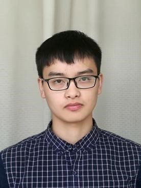

 
[**[Resume/CV]**](cvZZW.pdf)

### **Zhiwen Zhong**   
------------
**Master Degree Candidate**

**Laboratory of Neural Structure Biology**

**School of Life Sciences, University of Science and Technology of China(USTC)**

**443 Huangshan Road, Hefei, Anhui Province 230027, P.R.China**

**Tel: +86-13035064134**

**Email: zwzhong@mail.ustc.edu.cn**

### **Biography** 
------------
I am currently a final year (2019-2020) graduate student in the Department of Biology, the University of Science and Technology of China(USTC), supervised by Prof. Chao Wang and Prof. Mingjie Zhang. Previously, I received the B.S. degree from Department of Biology in Anhui University in 2017, under the supervision of Prof. Bei Huang.

My research lies at the intersection of medical image analysis and artificial intelligence. I am dedicated to designing data-efficient learning methods for biomedical image analysis. I also have expertise in deep learning for 3D vision. Recently, I am working on new learning algorithms while minimizing human supervision.

### **Selected Publications** 
------------
Xiang Fu, **Zhiwen Zhong** (Co-first author), Feng Hu, Yi Zhang, Chunxia Li, Peng Yan, Lixue Feng, Jinglian Shen, Bei Huang, The protective effects of selenium-enriched spirulina platensis on chronic alcohol-induced liver injury in mice. ***Food & function*** 2018 DOI: 10.1039/c8fo00477c

### **Reseach Experiences** 
------------
**[07/2019] Crystal Structure of HCFC2 Fn3 Domain**

•	Innovatively identified the interaction between TRIM46 and HCFC2, and partial structural information about the protein HCFC2. Screened out of HCFC2 protein from the RNA library of mouse brain using yeast two-hybrid technology;

•	Designed truncation according to biochemical properties and constructed into a 32M3C vector to express the truncation protein in Escherichia Coli. Further purified by FPLC after preliminary purification in Ni-column and obtained protein sample by high-speed centrifugation;

•	Added high purity protein samples to Hampton's primary screening reagent to crystallize. Respectively made the protein solutions with a different gradient of salt concentration, pH, and protein concentration for optimizing the protein crystal;

•	Conducted crystal diffraction for protein crystal. Preliminarily process the diffraction data by HKL3000 and carried out molecular replacement through CCP4. Obtained the high resolution 1.8 Å HCFC2 FN3 domain structure with Phenix refine after COOT manual modification.

**[01/2019] TRIM46 and HCFC2 Co-localized in the AIS with Ankyrin-G in Hippocampus**

•	Carefully minimized contaminating cell types (i.e. astrocytes) from newborn C57 mice and cultured in Glibo CNB medium for four days;

•	Co-transfected Flag-TRIM46 and GFP-HCFC2 plasmids to hippocampus cells using calcium phosphate transfection and cultured for another three days;

•	Harvested the hippocampus cells on day 7. Observed in ZEISS LSM 710 confocal laser scanning microscope and found co-localization in AIS where ankyrin-G exists as a marker;

•	Co-localization also existed in HeLa cells. HCFC2 form fibers in cytoplasm overlapped with TRIM46 while only expressed in nuclear when transfected alone.

**[04/2018] Use Yeast Two-hybrid to Screen Protein that Can Bind with TRIM46**

•	Inserted TRIM46 gene into yeast vector pGBKT7 and grow in ampicillin plate to duplicate the plasmid;

•	Prepared competent cells of Y2H and transferred pGBKT7-TRIM46 to it using Yeastmaker Yeast Transformation System growing for a week;

•	Hybridized Y2H strain and Y187 strain from Takara's mouse brain library. Mixed protein X from mouse brain library and TRIM46 which expressed by hybrid generation. Activated reporter genes so that it was showing activation traits;

•	Isolated plasmid by using Clontech Easy Yeast Plasmid Isolation Kit. Obtained the plasmid of protein X excluding TRIM46 and detected 24 positive results from subsequent gene sequencing;

•	Verified there interaction by co-transferring pGBKT7-TRIM46 and pGADT7-HCFC2 to Y187 strain and found it can activate reporter genes;

•	Detected that TRIM46 overlapped with HCFC2 via immunofluorescence co-localization in HeLa cells.

**[06/2017]  The Protective Effects of Selenium-Enriched Spirulina Platensis on Chronic Alcohol-Induced Liver Injury in Mice**

•	Used Zarrouk medium to shake table culture under conditions of 20-22 ℃, pH 9, the light intensity of 3000 ~ 4000 Lx, and light intensity of 14 hours per day. Respectively added sodium selenite to make the final concentration of culture solution reach 450 mg/L on the 7th, 8th and 9th day of culture;

•	Raised KM mice in an environment of 25±2℃, free diet, 12 h cycle of light every day, and randomly divided into 2 groups (the control group and the alcohol group) with 60 animals in each group after one week of adaptive feeding;

•	Gavaged the control group with distilled water and the alcohol group with alcohol for 6 weeks to establish a model of chronic alcoholic liver injury. Detected the content of alanine amino-transferase (ALT), aspartate aminotransferase (AST), total cholesterol (TC), Triglyceride (TG) of two groups; 

•	Divided 60 mice from the alcohol group into six groups, each containing 10 mice as follows: the model group; the control group; and the low-, middle-, high-dose Se-SP and SP groups. Treated mice in the four test groups with daily doses of 100, 200, and 400 mg per kg bodyweight of Se-SP and 200 mg per kg bodyweight of SP respectively, for 42 consecutive days;

•	Treated mice in the normal and model groups with saline. Detected the content decrease of ALT, AST, TC, TG content compared with the alcohol group;

•	Made and observed liver tissue slices under an optical microscope. Found that liver cells in the group with different concentrations of Se-enriched spirulina were healthier than those in the alcohol group, and the repair effect of Se-enriched spirulina in medium concentration was the best；

•	Conducted immunohistochemical experiment to explore the mechanism of repairing the chronic liver injury in mice and found that the repair of chronic alcoholic liver injury by Se-enriched spirulina was mainly conducted by apoptosis, supplemented by autophagy.

### **Selected Honors and Awards**
------------
[9/2019] Academic Scholarship, University of science and technology of China

[9/2018] Academic Scholarship, University of science and technology of China

[9/2017] Academic Scholarship, University of science and technology of China 

[12/2015] Outstanding scholarship of Anhui University

### **Extracurricular Activities**
------------
[11/2015] **Leader**, Hefei Botanical Garden Nameplate Activity

[11/2015] **Project Leader**, Anhui Province Entrepreneurship Simulation Training

[07/2014-07/2015] **Minister**, the publicity department of Baidu Baike Club, Anhui University
